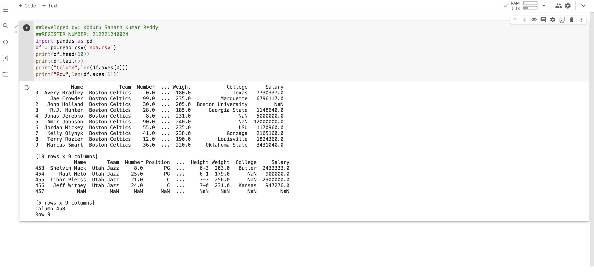

# Read-from-CSV

AIM:

To write a python program to read content from a csv file.

## ALGORITHM:

### Step 1:

Start python

### Step 2:

Import the required csv file.

### Step 3:

Import pandas

### Step 4:

Read the csv file by using df.read.

### Step 5:

Display the Columns.

###Step 6:

Display the Rows.

###Step 7:

End the program
## PROGRAM:
~~~
##Developed by: Koduru Sanath Kumar Reddy     
##REGISTER NUMBER: 212221240024
import pandas as pd
df = pd.read_csv('nba.csv')
print(df.head(10))
print(df.tail())
print("Column",len(df.axes[0]))
print("Row",len(df.axes[1]))
~~~

## OUTPUT:

## RESULT:
Therefore the above python code is successfully executed to read the content from a csv file.
